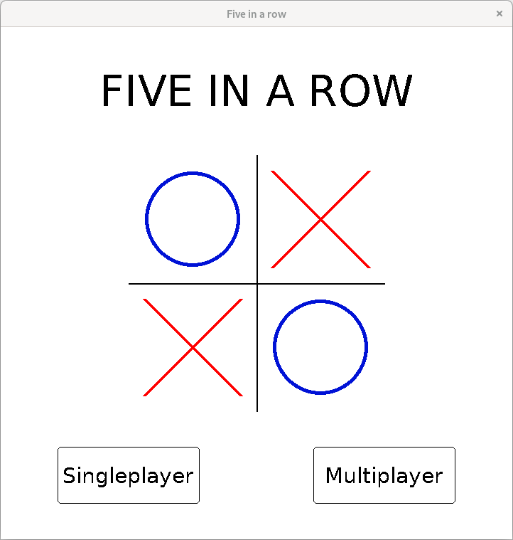
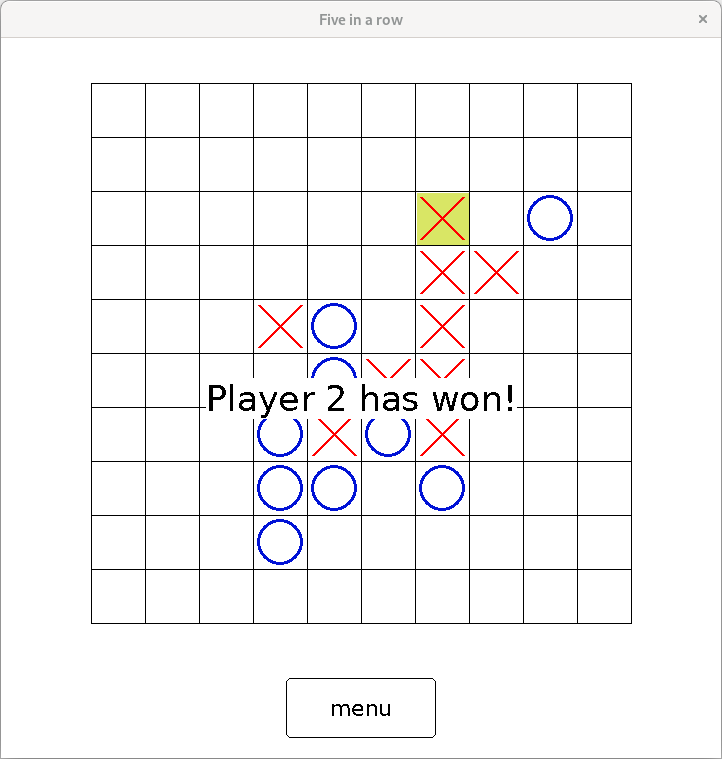

# Five in a row

Five in a Row is an extended version of Tic-Tac-Toe. This program offers multiplayer version to enjoy with your friends, or singleplayer version, in which you will be challenged by rudimentary AI.

It is played on a larger board and the first player to establish five of their symbols in a row (horizontally, vertically, or diagonally) wins.

